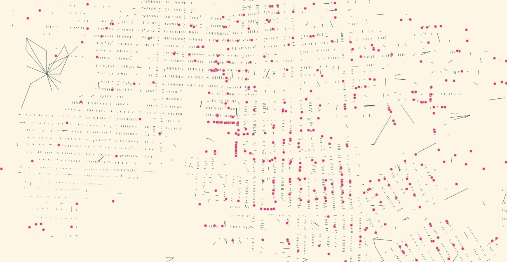

Dedupe
===

Code for deduplicating OpenAddresses data, currently U.S. English only.
Uses PostGIS to store addresses, and outputs GeoJSON with a mix of linestring
features for matched groups of addresses and point features for unmatched
single addresses.

In this example image of [Butte, MT](http://www.openstreetmap.org/#map=15/46.0096/-112.5444)
dark-colored linestrings show addresses that have been matched between county
and statewide sources, while magenta dots show addresses that have not been
matched all. This shows that most normal addresses in Butte are correctly
deduped between county and statewide sources:

Sample Usage
---

Sample usage to import data from `/tmp/us` to PostGIS `addresses` table
and generate and `expanded.geojson` file:

    $ python import.py
    $ python expand-map.py | sort | python expand-reduce.py

Sample Times
---

These samples were all run on a Virtualbox virtual machine:
Ubuntu 14.04, 1x CPU, 2GB memory, Python 3.4, and PostGIS.

All of Santa Clara Valley:

- 728,279 address rows in 38.4 seconds.
- 52,629 comparison tiles sorted in 36.9 seconds.
- 477,829 output features: 228,134 (65.5%) merged in 137.0 seconds.

Southwest Montana:

- 376,003 address rows in 0:35 minutes (57% cpu).
- 252,644 comparison tiles sorted in 1:15 minutes (19% cpu).
- 228,426 output features: 135,896 (63.9%) merged in 1:32 minutes (56% cpu).

All of Montana:

- 1,011,515 address rows in 1:37 min (59% cpu).
- 702,745 comparison tiles sorted in 3:29 min (20% cpu).
- 603,294 merged features: 335,835 (66.8%) merged in 36:23 min (21% cpu).

Merging took a long time when expand-reduce.py thrashed on low physical RAM.
